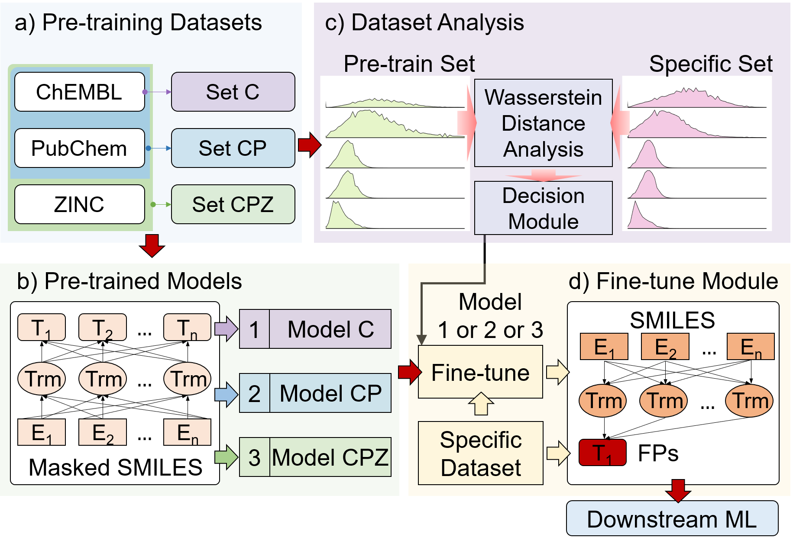

# Extracting Predictive Representations from Hundreds of Millions of Molecules

Source code of the paper "Extracting Predictive Representations from Hundreds of Millions of Molecules" by Dong Chen, Jiaxin Zheng, Guo-Wei Wei<sup>+</sup> and Feng Pan\*

---



---

[toc]

---

## Requirments

OS Requirements
- CentOS Linux 7 (Core)

Python Dependencies
- setuptools (>=18.0)
- python (>=3.7)
- pytorch (>=1.2)
- rdkit (2020.03)
- biopandas (0.2.7)
- numpy (1.17.4)
- scikit-learn (0.23.2)
- scipy (1.5.2)
- pandas (0.25.3)
- cython (0.29.17)


## Installation Guide

Install from Github

```shell
# download repository by git
git clone https://github.com/WeilabMSU/PretrainModels.git

cd PretrainModels/bt_pro
python setup.py build_ext --inplace
mv ./bt_pro/fairseq/data/* ./fairseq/data/
```

which should install in about 60 seconds.

## Downloading Pre-trained Models

There are three pre-trained models are provided in this work. All these three pre-trained models are publicly available.

```shell
# Pre-trained model
wget https://weilab.math.msu.edu/Downloads/chembl_pubchem_zinc_models.zip
unzip chembl_pubchem_zinc_models.zip
```

There are three folders in the .zip file,

1. **chembl27_512** contains pre-trained model 'checkpoint_best.pt' and dictionary file 'dict.txt'. The model was trained by using ChEMBL27 dataset.
2. **chembl27_pubchem_512** contains pre-trained model 'checkpoint_best.pt' and dictionary file 'dict.txt'. The model was trained by using the union of ChEMBL27 and PubChem datasets.
3. **chembl27_pubchem_zinc_512** contains pre-trained model 'checkpoint_best.pt' and dictionary file 'dict.txt'. The model was trained by using the union of ChEMBL27, PubChem, and ZINC datasts.

## Pre-trained model selection (Optional)

In this work, we proposed a scheam to select the best pre-trained model, which based on the wassertein distance analysis of the downstream datasets. For example, a given datasets `./examples/data/example.smi`

```shell
python ./util_tools/L2L_analysis_module.py --input_dataset ./examples/data/example.smi
```

The output of the program will give the selected pre-trained model.

## Customize task-specific fingerprints

For users who want to build a new task-specific model from a set of molecules with corresponding properties, here we provide script for generating the fingerprints. For different types of datasets, we provide different feature extraction methods.

Note: The following steps need to be performed on a platform that supports GPU computing.

#### 1. Generate features from pre-trained model

Generate Bidirectional Transformer-based Fingerprints(BT-FPs) from pre-trained model directly.

```shell
# generate the 
python "./bt_pro/generate_bt_fps.py" \
 --model_name_or_path "./examples/models/" \  # the path of foler, which contains pre-trained model
 --checkpoint_file "checkpoint_best.pt" \  # the name of pre-trained model
 --data_name_or_path  "./examples/models/" \  # the path of folder, which contains dict.txt
 --dict_file "./examples/models/dict.txt" \ # the path of dict.txt file
 --target_file "./examples/data/example.smi" \  # the path of target downstream dataset
 --save_feature_path "./examples/data/example_features.npy"  # the save path of generated features.
```

#### 2. Generate features from fine-tuned model (regression tasks)

Generate the BT-FPs from fine-tuned model. If you want this method to generate features, you need to divide the dataset into training set and validate set beforehand. Training and validate sets are then used to fine-tune the pre-trained model by supervised learning method.

- Step1, prepare the pre-trained model and relate dict.txt.

```shell
# Assume that pre-trained model 'checkpoint_best.pt' and 'dict.txt' are in folder './examples/models'.
```

- Step2, pre-process input data (Binarize the input data to speed up the fine-tuning process.)

```shell
mkdir "./examples/data/regression_example/input0"  # the target folder must be input0
python "./bt_pro/preprocess.py" \
 --only-source --trainpref "./examples/data/regression_example/regression_train_canonical.smi" \
 --validpref "./examples/data/regression_example/regression_valid_canonical.smi" \
 --destdir "./examples/data/regression_example/input0" \  # folder path to save binzrized data
 --trainoutf "train" --validoutf "valid" \
 --workers 20 --file-format smiles \
 --srcdict "./examples/models/dict.txt"  # the dict.txt used for pre-training

mkdir "./examples/data/regression_example/label"
cp "./examples/data/regression_example/regression_train.label" "./examples/data/regression_example/label/train.label"
cp "./examples/data/regression_example/regression_valid.label" "./examples/data/regression_example/label/valid.label"
```

- Step3, fine-tuning the pre-trained model

```shell
mkdir './examples/models/finetuned_model_regression'
train_data_len=283  # training data size
num_epoch=50
num_sent_pergpu=16
updata_freq=1
num_warmup=`expr $num_epoch \* $train_data_len / ${num_sent_pergpu} / $updata_freq / 10 `
max_num_update=100000
CUDA_VISIBLE_DEVICES=0 python "./bt_pro/train.py" \  # if just want to run in cpu, remove 'CUDA_VISIBLE_DEVICES=0'
 "./examples/data/regression_example/" \  # data folder, which contains 'input0' and 'label' folders
 --save-dir './examples/models/finetuned_model_regression' \  # the save path of finetuned model
 --train-subset train --valid-subset valid \
 --restore-file './examples/models/checkpoint_best.pt' \  # load the pre-trained model
 --task sentence_prediction --num-classes 1 --regression-target --init-token 0 --best-checkpoint-metric loss --arch roberta_base --bpe smi --encoder-attention-heads 8 --encoder-embed-dim 512 --encoder-ffn-embed-dim 1024 --encoder-layers 8 --dropout 0.1 --attention-dropout 0.1 --criterion sentence_prediction --max-positions 256 --truncate-sequence --skip-invalid-size-inputs-valid-test --optimizer adam --adam-betas '(0.9,0.999)' --adam-eps 1e-6 --clip-norm 0.0 --lr-scheduler polynomial_decay --lr 0.0001 --warmup-updates ${num_warmup} --total-num-update  ${max_num_update} --max-update ${max_num_update} --max-epoch ${num_epoch} --weight-decay 0.1 --log-format simple --reset-optimizer --reset-dataloader --reset-meters --no-epoch-checkpoints --no-last-checkpoints --no-save-optimizer-state --find-unused-parameters --log-interval 5 --max-sentences ${num_sent_pergpu} --update-freq ${updata_freq} --required-batch-size-multiple 1 --ddp-backend no_c10d
```

- Step4, generate BT-FPs from finetuned model

```shell
cp "./examples/models/dict.txt" "./examples/data/regression_example/"
python "./bt_pro/generate_bt_fps.py" \
 --model_name_or_path './examples/models/finetuned_model_regression/' \  # the path of foler, which contains pre-trained model
 --checkpoint_file "checkpoint_best.pt" \  # the name of fine-tuned model
 --data_name_or_path  "./examples/data/regression_example/" \  # the folder contains input0
 --dict_file "./examples/data/regression_example/dict.txt" \  #  can just use the pretrained dict.txt
 --target_file "./examples/data/regression_example/regression_train_canonical.smi" \  # the path of target downstream dataset
 --save_feature_path "./examples/data/regression_example/regression_train_canonical.npy"  # the save path of generated features.
 
python "./bt_pro/generate_bt_fps.py" \
 --model_name_or_path './examples/models/finetuned_model_regression/' \  # the path of foler, which contains pre-trained model
 --checkpoint_file "checkpoint_best.pt" \  # the name of fine-tuned model
 --data_name_or_path  "./examples/data/regression_example/" \  # the folder contains input0
 --dict_file "./examples/data/regression_example/dict.txt" \  #  can just use the pretrained dict.txt
 --target_file "./examples/data/regression_example/regression_valid_canonical.smi" \
 --save_feature_path "./examples/data/regression_example/regression_valid_canonical.npy"
# if you have test.smi, generating the feature from fine-tuned model fallow the same way.

```

#### 3. Generate features from fine-tuned model (classification tasks)

Generate the BT-FPs from fine-tuned model. If you want this method to generate features, you also need to divide the dataset into training set and validate set beforehand. Training and validate sets are then used to fine-tune the pre-trained model by supervised learning method.

- Step1, prepare the pre-trained model and relate dict.txt.

```shell
# Assume that pre-trained model 'checkpoint_best.pt' and 'dict.txt' are in folder './examples/models'.
```

- Step2, pre-process input data (Binarize the input data to speed up the fine-tuning process.)

```shell
mkdir "./examples/data/classification_example/input0"  # the target folder must be input0
python "./bt_pro/preprocess.py" \
 --only-source --trainpref "./examples/data/classification_example/classification_train_canonical.smi" \
 --validpref "./examples/data/classification_example/classification_valid_canonical.smi" \
 --destdir "./examples/data/classification_example/input0" \  # folder path to save binzrized data
 --trainoutf "train" --validoutf "valid" \
 --workers 20 --file-format smiles \
 --srcdict "./examples/models/dict.txt"  # the dict.txt used for pre-training

```

- Step3, pre-process input data's label (Binarize the label.)

```shell
mkdir "./examples/data/classification_example/label"  # the target folder must be label
python "./bt_pro/preprocess.py" \
 --only-source --trainpref "./examples/data/classification_example/classification_train.label" \
 --validpref "./examples/data/classification_example/classification_valid.label" \
 --destdir "./examples/data/classification_example/label" \  # folder path to save binzrized data
 --trainoutf "train" --validoutf "valid" \
 --workers 20 --file-format smiles

```

- Step4, fine-tuning the pre-trained model

```shell
mkdir './examples/models/finetuned_model_classification'
train_data_len=283  # training data size
num_epoch=50
num_sent_pergpu=16
updata_freq=1
num_warmup=`expr $num_epoch \* $train_data_len / ${num_sent_pergpu} / $updata_freq / 10 `
max_num_update=100000
CUDA_VISIBLE_DEVICES=0 python "./bt_pro/train.py" \  # if just want to run in cpu, remove 'CUDA_VISIBLE_DEVICES=0'
 "./examples/data/classification_example/" \  # data folder, which contains 'input0' and 'label' folders
 --save-dir './examples/models/finetuned_model_classification' \  # the save path of finetuned model
 --train-subset train --valid-subset valid \
 --restore-file './examples/models/checkpoint_best.pt' \  # load the pre-trained model
 --task sentence_prediction --num-classes 2 \  # the number of classification
 --init-token 0 --best-checkpoint-metric accuracy \
 --maximize-best-checkpoint-metric \
 --arch roberta_base --bpe smi --encoder-attention-heads 8 --encoder-embed-dim 512 --encoder-ffn-embed-dim 1024 --encoder-layers 8 --dropout 0.1 --attention-dropout 0.1 --criterion sentence_prediction --max-positions 256 --truncate-sequence --skip-invalid-size-inputs-valid-test --optimizer adam --adam-betas '(0.9,0.999)' --adam-eps 1e-6 --clip-norm 0.0 --lr-scheduler polynomial_decay --lr 0.0001 --warmup-updates ${num_warmup} --total-num-update  ${max_num_update} --max-update ${max_num_update} --max-epoch ${num_epoch} --weight-decay 0.1 --log-format simple --reset-optimizer --reset-dataloader --reset-meters --no-epoch-checkpoints --no-last-checkpoints --no-save-optimizer-state --find-unused-parameters --log-interval 5 --max-sentences ${num_sent_pergpu} --update-freq ${updata_freq} --required-batch-size-multiple 1 --ddp-backend no_c10d
```

- Step5, generate BT-FPs from finetuned model

```shell
cp "./examples/models/dict.txt" "./examples/data/classification_example/"
python "./bt_pro/generate_bt_fps.py" \
 --model_name_or_path './examples/models/finetuned_model_classification/' \  # the path of foler, which contains pre-trained model
 --checkpoint_file "checkpoint_best.pt" \  # the name of fine-tuned model
 --data_name_or_path  "./examples/data/classification_example/" \  # the folder contains input0
 --dict_file "./examples/data/classification_example/dict.txt" \  #  can just use the pretrained dict.txt
 --target_file "./examples/data/classification_example/classification_train_canonical.smi" \  # the path of target downstream dataset
 --save_feature_path "./examples/data/classification_example/classification_train_canonical.npy"  # the save path of generated features.
 
python "./bt_pro/generate_bt_fps.py" \
 --model_name_or_path './examples/models/finetuned_model_classification/' \  # the path of foler, which contains pre-trained model
 --checkpoint_file "checkpoint_best.pt" \  # the name of fine-tuned model
 --data_name_or_path  "./examples/data/classification_example/" \  # # the folder contains input0
 --dict_file "./examples/data/classification_example/dict.txt" \  #  can just use the pretrained dict.txt
 --target_file "./examples/data/classification_example/classification_valid_canonical.smi" \
 --save_feature_path "./examples/data/classification_example/classification_valid_canonical.npy"
# if you have test.smi, generating the feature from fine-tuned model fallow the same way.

```

Note:
- The comments  of the command line needs to be removed when used.
- Don't leave empty space after `\` symbol.
- The entire process took less than 30 minutes.

## Repeatability

- In this work, all 5 regression datasets and 5 classification datasets are publicly avaliable in https://weilab.math.msu.edu/DataLibrary/2D/.
- For each data set, we divide the data into training set, validation set and test set according to the ratio of 8:1:1. The above process is repeated ten times according to different random numbers. The data splitting for all experiments is saved in `./util_tools/repeat_10_random/`
- The pre-training datasets used in this work is the combination of ChEMBL27, PubChem, and ZINC13 3D datasets, which is publicly available at https://ftp.ebi.ac.uk/pub/databases/chembl/ChEMBLdb/releases/chembl_27/, https://ftp.ncbi.nih.gov/pubchem/Compound/, and http://files.docking.org/3D/, respectively.

## License

All codes released in this study is under the MIT License.
